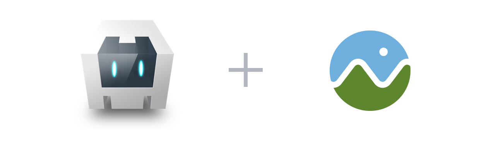
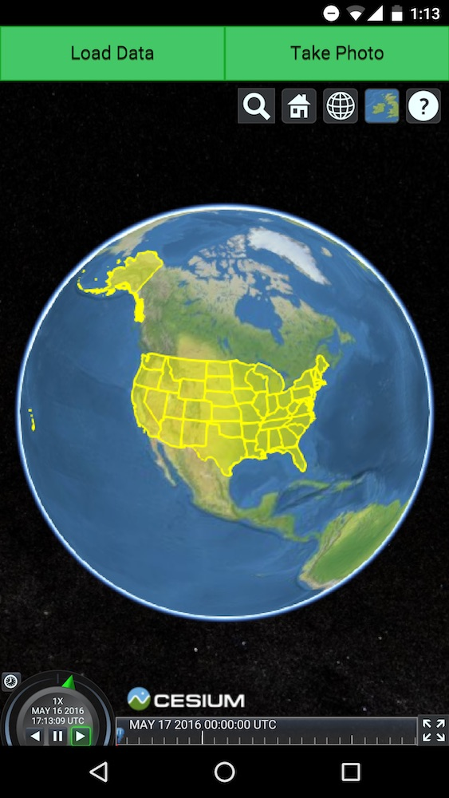

# CesiumMobile

CesiumMobile is a Android mobile app that runs [Cesium](http://cesiumjs.org/) built on [Cordova](https://cordova.apache.org/). This app allows users to load local data and place billboards at their current geographic location with photos taken from their phone's camera. Users can also load the local imagery, Natural Earth II, for a complete offline experience.

## Setup

Run `npm install -g cordova`

## Build

Run `cordova platform add android`

Run `cordova build`

For creating your own Cesium Android app using Cordova check out [this](http://cesiumjs.org/2016/05/18/An-Introduction-to-Cesium-Android-Apps-with-Cordova/) blog post.
